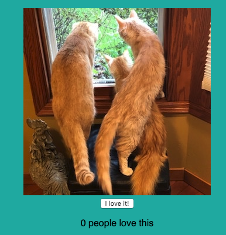

### React Gallery-Ashleygram

## Description
*Duration: 2 Days*

This project is a photo gallery display app that allows the user to share photos. Visitors to the gallery can view a description of the images and "love" images they particularly like.

## Screen Shot

## Prerequisites
-Node.js
-Nodemon

## Installation
1. Open your code editor and run `npm install`,
2. Run `npm run server` in the terminal,
3. Open a second terminal and run `npm run client`,
4. Upon running `npm run client` a browser tab will open for you.

## Usage
For additional information on a given photo, click on the image and it will toggle to a description. You can click on the description to toggle back to the photo as well.

If you really like an image, click the "Love it!" button!

## Built With
-React
-JavaScript
-Axios

## Acknowledgement
Thank you to Prime Digital Academy for providing the knowledge needed to create this application!

## Support
For suggestions or issues, please email me at aescott87@gmail.com
